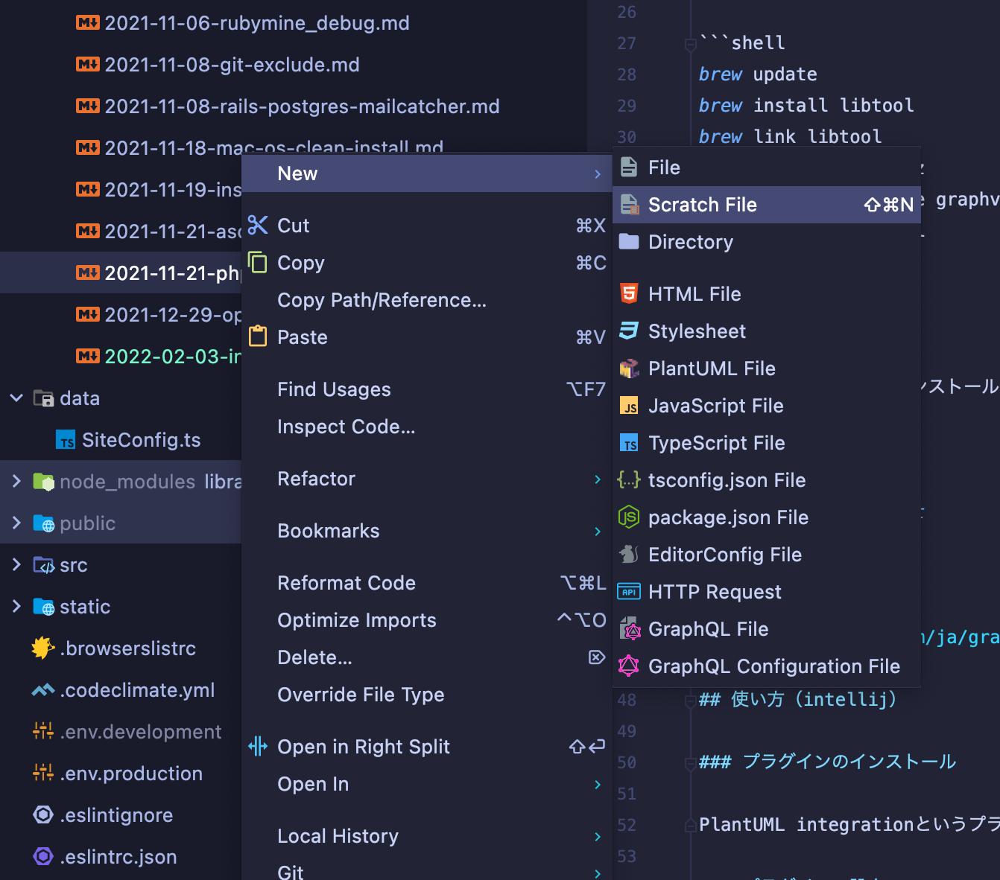
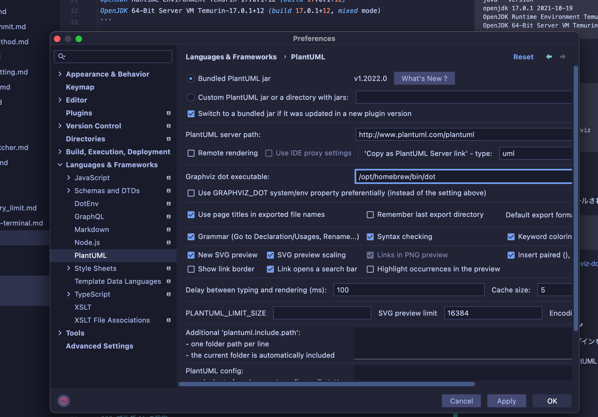

MacOSでのPlantUMLのインストール方法をまとめました。

## 前提

ローカルにJavaがインストールされている必要があります。

```shell
java --version
openjdk 17.0.1 2021-10-19
OpenJDK Runtime Environment Temurin-17.0.1+12 (build 17.0.1+12)
OpenJDK 64-Bit Server VM Temurin-17.0.1+12 (build 17.0.1+12, mixed mode)
```

## インストール方法

```shell
brew update
brew install libtool
brew link libtool
brew install graphviz
brew link --overwrite graphviz
brew install plantuml
```

## 確認

dotというプログラムがインストールされていれば、GraphVizはインストール済みです。

```shell
which dot
/opt/homebrew/bin/dot
```

参考
<https://plantuml.com/ja/graphviz-dot>

## 使い方（intellij）

### プラグインのインストール

PlantUML integrationというプラグインをインストールしましょう。

<https://plugins.jetbrains.com/plugin/7017-plantuml-integration>

インストールすると、New > PlantUML File が表示されているはずです。



### プラグインの設定

PlantUMLのプラグインを動作させるには、`dot`へのパスを追加する必要があります。

`/opt/homebrew/bin/dot` Graphviz dot executable: に設定します。



## 使い方（vscode）

特に設定は不要でPlantUMLというプラグインをインストールしておけば、書き始めることができます。

<https://marketplace.visualstudio.com/items?itemName=jebbs.plantuml>

## 参考

- <https://plantuml.com/ja/>
- <https://plugins.jetbrains.com/plugin/7017-plantuml-integration>
- <https://marketplace.visualstudio.com/items?itemName=jebbs.plantuml>